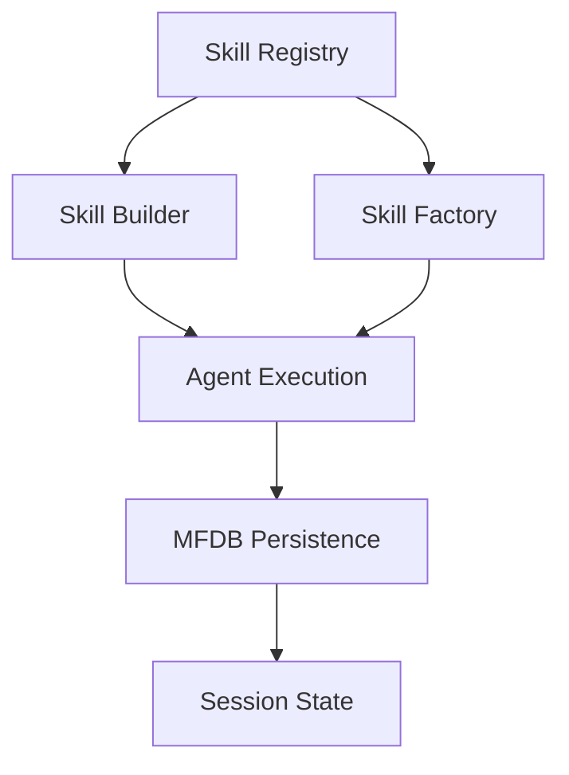

# BEJSON Skills System (BEJSON_Skills_System)
> Decentralized Agentic Intelligence Registry & Execution Framework.

  

## Overview
The BEJSON Skills System is the cognitive backbone of the Elton Boehnen ecosystem. It provides a standardized framework for defining, registering, and executing "Skills"—modular agentic capabilities that leverage the BEJSON data standard for persistence and inter-agent communication.

## Skill Network Architecture


## Quick Start
```bash
# Register a new skill
python3 skill-registry/scripts/init_skill.py "my-new-skill"
```

## Core Ecosystem Skills
- **bejson-manager**: Core structural validation and manipulation.
- **debug-doublecheck**: Forensic verification and regression testing.
- **robot-relay**: High-density, low-noise communication protocol.
- **analysis-perceptual**: Deep system mapping and intent distillation.

## Documentation
- [AGENTS.md](./AGENTS.md) — Mandatory protocols for skill modification.
- [llms.txt](./llms.txt) — Machine-readable skill index.

---
**Elton Boehnen** · eltonboehnen@gmail.com · [github.com/boehnenelton](https://github.com/boehnenelton)
